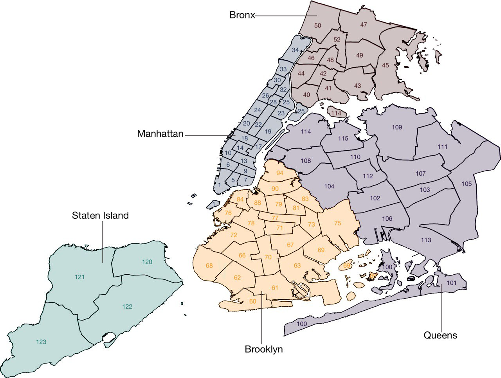
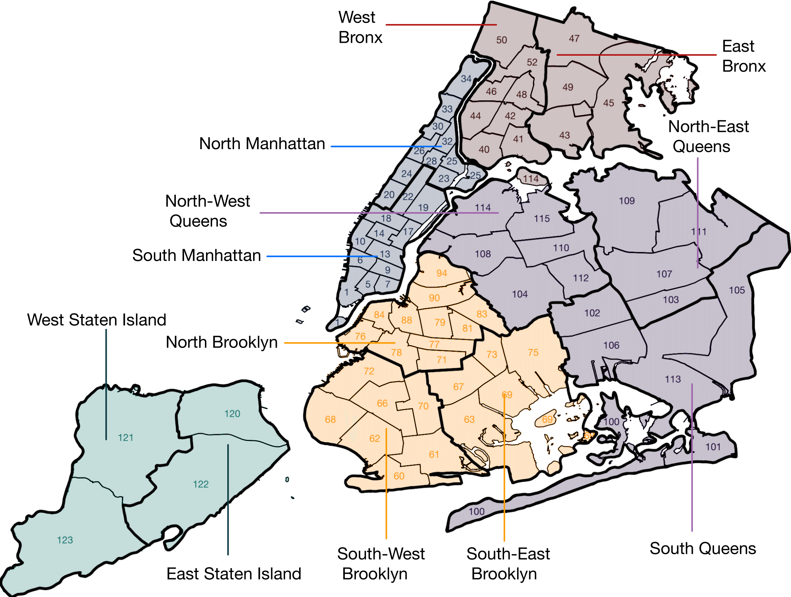

```{r setup, include=FALSE}
knitr::opts_chunk$set(echo = TRUE, warning = FALSE, message = FALSE)
```

# Requirements

```{r requirements}
requirements=c("summarytools","plotly", "ggplot2", "plyr","dplyr", "lubridate","ggmap", "ggdensity", "patchwork")

for (req in requirements){
  if (!require(req, character.only = TRUE)){
      install.packages(req)
  }
}
```

```{r, include=FALSE}
theme_set(theme_gray(base_size = 15))

st_options(headings = FALSE)
```


# Data Description

List of every shooting incident that occurred in NYC going back to 2006 through the end of the previous calendar year.

This is a breakdown of every shooting incident that occurred in NYC going back to 2006 through the end of the previous calendar year. This data is manually extracted every quarter and reviewed by the Office of Management Analysis and Planning before being posted on the NYPD website. Each record represents a shooting incident in NYC and includes information about the event, the location and time of occurrence. In addition, information related to suspect and victim demographics is also included. This data can be used by the public to explore the nature of shooting/criminal activity. Please refer to the attached data footnotes for additional information about this dataset.

Each row is a Shooting Incident.

There are 21 columns:

1) `INCIDENT_KEY`: Randomly generated persistent ID for each arrest (text)

2) `OCCUR_DATE`: Exact date of the shooting incident (date)

3) `OCCUR_TIME`: Exact time of the shooting incident (time)

4) `BORO`: Borough where the shooting incident occurred (categorical)

5) `LOC_OF_OCCUR_DESC`: where the shooting incident took place: "inside", "outside" or not specified. (categorical)

6) `PRECINCT`: Precinct where the shooting incident occurred. (categorical)

7) `JURISDICTION_CODE`: Jurisdiction where the shooting incident occurred. Jurisdiction codes 0(Patrol), 1(Transit) and 2(Housing) represent NYPD whilst codes 3 and more represent non NYPD jurisdictions. 

8) `LOC_CLASSFCTN_DESC`: description of the classification of the location of the shooting incident: COMMERCIAL, DWELLING, HOUSING, OTHER, PARKING LOT, PLAYGROUND, STREET, TRANSIT, VEHICLE or not specified. 

9) `LOCATION_DESC`: Location of the shooting incident (categorical)

10) `STATISTICAL_MURDER_FLAG`: Shooting resulted in the victim’s death which would be counted as a murder (categorical, binary)

11) `PERP_AGE_GROUP`: Perpetrator’s age within a category (categorical)

12) `PERP_SEX`: Perpetrator’s sex description (categorical)

13) `PERP_RACE`: Perpetrator’s race description (categorical)

14) `VIC_AGE_GROUP`: Victim’s age within a category (categorical)

15) `VIC_SEX`: Victim's sex description (categorical)

16) `VIC_RACE`: Victim’s race description 

17) `X_COORD_CD`: Midblock X-coordinate for New York State Plane Coordinate System, Long Island Zone, NAD 83, units feet (FIPS 3104) 

18) `Y_COORD_CD`: Midblock Y-coordinate for New York State Plane Coordinate System, Long Island Zone, NAD 83, units feet (FIPS 3104) (text)

19) `Latitude`: Latitude coordinate for Global Coordinate System, WGS 1984, decimal degrees (EPSG 4326) (numerical)

20) `Longitude`: Longitude coordinate for Global Coordinate System, WGS 1984, decimal degrees (EPSG 4326) (numerical)

21) `Lon_Lat`: Longitude and Latitude Coordinates for mapping (point)

link to the data: https://data.cityofnewyork.us/Public-Safety/NYPD-Shooting-Incident-Data-Historic-/833y-fsy8

## Analysis description

This analysis is based on a binary classification task: prediction of the victim survival based on the available information.

Specifically, I will answer the following questions:

- Is survival more likely in a specific neighborhood?

- Is it more likely to survive based on gender/age of the victim? (obviously younger victims should be more likely to survive.)

- Is it more likely to survive based on the victim's ethnicity?

- Is it more likely to survive if the shooter belongs to a different/same ethnicity than the victim?

- Is it more likely to survive based on sex/age/ethnicity of the perpetrator?

- Is there a trend with respect to the date on which the incident occurred?

- Is survival less likely in late hours?

- Is it more likely to survive on a weekday?

- What happened during the pandemic period?

# Data exploration and cleaning

```{r}
shootings = read.csv("data/NYPD_Shooting_Incident_Data__Historic__20231218.csv", stringsAsFactors = TRUE)
```

```{r}
dim(shootings)
```

```{r}
print(dfSummary(shootings), method="render")
```

For variables `LOC_OF_OCCUR_DESC`, `LOC_CLASSFCTN_DESC`, `LOCATION_DESC`, `PERP_AGE_GROUP`, `PERP_SEX`, `PERP_RACE` are present both '' and '(null)' values: we consider these as missing values. Furthermore, I should transform `INCIDENT_KEY`, `PRECINCT` and `JURISDICTION_CODE` in factors.

```{r}
shootings = read.csv("data/NYPD_Shooting_Incident_Data__Historic__20231218.csv", na.strings = c('','(null)'), stringsAsFactors = TRUE)
shootings$INCIDENT_KEY = as.factor(shootings$INCIDENT_KEY)
shootings$PRECINCT = as.factor(shootings$PRECINCT)
shootings$JURISDICTION_CODE = as.factor(shootings$JURISDICTION_CODE)
```

```{r}
print(dfSummary(shootings), method="render")
```
## Response

The response variable `STATISTICAL_MURDER_FLAG` is unbalanced: only 19.3% of the shooting incidents are also murders. 
For better visualization I decided to rename it along with its levels:

```{r}
#rename murder
shootings$murder <- shootings$STATISTICAL_MURDER_FLAG
levels(shootings$murder) <- c("FALSE", "TRUE")

shootings$STATISTICAL_MURDER_FLAG <- NULL
```

Furthermore I create another variable in probability format:

```{r}
#create response
shootings$murder_prob <- shootings$murder
levels(shootings$murder_prob) <- c(0,1)
shootings$murder_prob <- as.numeric(as.character(shootings$murder_prob))
```

## Missing values

As specified in `NYPD Shooting Incident Level Data Footnotes` (pdf file in data folder), null values should be considered as either “Unknown/Not Available/Not Reported”. Thus I consider missing values as 'Unknown'. For some predictors the 'Unknown' level is already specified thus I merge the two levels.

```{r}
NA_as_unknown <- function(predictor, new_name="UNKNOWN"){
  lev=c(levels(predictor), new_name)
  return(factor( ifelse(is.na(predictor), new_name, predictor), labels = lev))
}

shootings$LOC_OF_OCCUR_DESC <- NA_as_unknown(shootings$LOC_OF_OCCUR_DESC)
shootings$JURISDICTION_CODE <- NA_as_unknown(shootings$JURISDICTION_CODE)
shootings$LOC_CLASSFCTN_DESC <- NA_as_unknown(shootings$LOC_CLASSFCTN_DESC)
shootings$LOCATION_DESC <- NA_as_unknown(shootings$LOCATION_DESC)
shootings$PERP_AGE_GROUP <- NA_as_unknown(shootings$PERP_AGE_GROUP)
shootings$PERP_SEX <- NA_as_unknown(shootings$PERP_SEX, "U")
shootings$PERP_RACE <- NA_as_unknown(shootings$PERP_RACE)
```

The "UNKNOWN" levels are used as reference for all the factors for better visualization. Those levels will be dropped in the following sections before using any model.

```{r}
shootings$LOC_OF_OCCUR_DESC <- relevel(shootings$LOC_OF_OCCUR_DESC, "UNKNOWN")
shootings$JURISDICTION_CODE <- relevel(shootings$JURISDICTION_CODE, "UNKNOWN")
shootings$LOC_CLASSFCTN_DESC <- relevel(shootings$LOC_CLASSFCTN_DESC, "UNKNOWN")
shootings$LOCATION_DESC <- relevel(shootings$LOCATION_DESC, "UNKNOWN")
shootings$PERP_AGE_GROUP <- relevel(shootings$PERP_AGE_GROUP, "UNKNOWN")
shootings$PERP_SEX <- relevel(shootings$PERP_SEX, "U")
shootings$PERP_RACE <- relevel(shootings$PERP_RACE, "UNKNOWN")
shootings$VIC_AGE_GROUP <- relevel(shootings$VIC_AGE_GROUP, "UNKNOWN")
shootings$VIC_SEX <- relevel(shootings$VIC_SEX, "U")
shootings$VIC_RACE <- relevel(shootings$VIC_RACE, "UNKNOWN")
```

## Temporal data

In this data set are present 2 variable which gives information on the time and date of the incident, respectively: `OCCUR_TIME` and `OCCUR_DATE`.

```{r}
print(dfSummary(shootings[c("OCCUR_TIME","OCCUR_DATE")]), method="render")
```

Both variables have a lot of levels. It is reasonable to aggregate some levels of these variables or extract useful information from them.

### Time

For variable `OCCUR_TIME` i decided to create a variable describing the period of the day: 

  * early morning: from 05:00 to 8:59
  
  * morning: from 09:00 to 12:59 
  
  * early afternoon: from 13:00 to 15:59 
  
  * afternoon: from 16:00 to 19:59 
  
  * evening: from 20:00 to 22:59 
  
  * night: from 23:00 to 04:00

```{r}
#convert to character
shootings$hour <- as.character(shootings$OCCUR_TIME)

#split by ":"
shootings$hour <- strsplit(shootings$hour, ":")

shootings$hour <- rapply(shootings$hour, function(x){ x[1] })

shootings$hour <- as.factor(shootings$hour)
```

```{r}
shootings$day_period <- rapply( as.list(as.numeric(as.character(shootings$hour))), function(x){

  y <- "Night"
    
  if (x>=5 & x<=8){
    y <- "EarlyMorning"
  }else if(x>=9 & x<=12){
    y <- "Morning"
  }else if(x>=13 & x<=15){
    y <- "EarlyAfternoon"
  }else if(x>=16 & x<=19){
    y <- "Afternoon"
  }else if(x>=20 & x<=22){
    y <- "Evening"
  }
  
  y
})

shootings$day_period <- as.factor(shootings$day_period)

shootings$day_period <- factor(shootings$day_period, levels=c('EarlyMorning', 'Morning', 'EarlyAfternoon', 'Afternoon', 'Evening', 'Night'))
```

Could be also useful to have a variable describing whenever the hour is a work hour or not:

```{r}
shootings$working_hour <- rapply( as.list(as.numeric(as.character(shootings$hour))), function(x){

  y <- "FALSE"
    
  if (x>=9 & x<=17){
    y <- "TRUE"
  }
  
  y
})

shootings$working_hour <- as.factor(shootings$working_hour)
```

```{r}
shootings$hour <- NULL
```

### Date

For variable `OCCUR_DATE` i decided to extract useful information:
  
  * the year

  * the day of the year
  
  * the day of the week (categorical)
  
  * whatever the day is a working day (Monday to Friday) or not (Saturday and Sunday)

```{r}
#convert to character
dates <- as.character(shootings$OCCUR_DATE)

#convert to date
dates.date <- as.Date(dates, format = "%m/%d/%Y") 

#create weekday variable
shootings$week_day <- as.factor(weekdays(dates.date))
shootings$week_day <- factor(shootings$week_day, levels=c('Monday', 'Tuesday', 'Wednesday', 'Thursday', 'Friday', 'Saturday', 'Sunday'))

#create working_day variable
shootings$working_day <- rapply( as.list(as.character(shootings$week_day)), function(x){
  
  y <- "TRUE"
    
  if (x=="Sunday" | x=="Saturday"){
    y <- "FALSE"
  }
  
  y
})

shootings$working_day <- as.factor(shootings$working_day)

shootings$year <- year(dates.date)
shootings$day_year <- yday(dates.date)
```

Could be also useful to have information specific on the COVID pandemic. Thus I created a two variable describing:

*   whatever the day occurred during COVID lock-down in New York period or not.
    The period I considered was from 2020-03-22 to 2020-9-30 (I considered both the "Stay-at-home order" and the entire "Four-phase reopening plan", for addiction information see: <https://en.wikipedia.org/wiki/COVID-19_pandemic_in_New_York_City> ).

*   whatever the day occurred during COVID pandemic or not.
    The period I considered was from 2020-03-11 (WHO declares the pandemic) to 2022-12-31 (most recent date in data set). For additional information see: <https://en.wikipedia.org/wiki/COVID-19_pandemic>

```{r}
shootings$COVID_lockdown <- rapply( as.list(dates.date), function(x){

  y <- "FALSE"
  
  if (as.Date("2020-03-22")<=x & x<=as.Date("2020-9-30")){
    y <- "TRUE"
  }
  
  y
})

shootings$COVID_pandemic <- rapply( as.list(dates.date), function(x){

  y <- "FALSE"
  
  if (as.Date("2020-03-11")<=x & x<=as.Date("2022-12-31")){
    y <- "TRUE"
  }
  
  y
})

shootings$COVID_lockdown <- as.factor(shootings$COVID_lockdown)
shootings$COVID_pandemic <- as.factor(shootings$COVID_pandemic)
```

```{r}
dates.date<-NULL
dates<-NULL
```

### Working Day and Working Hour

Could be interesting to create a unique variable which gives information about working day and working hour. This new variable will substitute the old "working hour".

```{r}
shootings$working <-  as.logical(shootings$working_hour) & as.logical(shootings$working_day)

shootings$working_hour <- as.factor(shootings$working)

shootings$working_day <- NULL
shootings$working <- NULL
```

## Location data

In this data set are present 3 types of data which gives information on the information of the incident:

-   Geographical data:
    -   `X_COORD_CD`: Midblock X-coordinate for New York State Plane Coordinate System, Long Island Zone, NAD 83, units feet (FIPS 3104).
    -   `Y_COORD_CD`: Midblock Y-coordinate for New York State Plane Coordinate System, Long Island Zone, NAD 83, units feet (FIPS 3104).
    -   `Latitude`: Latitude coordinate for Global Coordinate System, WGS 1984, decimal degrees (EPSG 4326).
    -   `Longitude`: Longitude coordinate for Global Coordinate System, WGS 1984, decimal degrees (EPSG 4326).
    
-   Location description data:
    -   `LOC_OF_OCCUR_DESC`: whatever the incident occurred inside or outside.
    -   `LOC_CLASSFCTN_DESC`: description of the incident location within categories.
    -   `LOCATION_DESC`: general description of incident location.
    
-   City location data:
    -   `BORO`: borough where the shooting incident occurred.
    -   `PRECINCT`: precinct where the shooting incident occurred.

### Geographical data

Since pairs of variables (`X_COORD_CD`, `Y_COORD_CD`) and (`Latitude`, `Longitude`) represent the same information in different scales, I decided to use (`Latitude`, `Longitude`) because it is the most known format. Since there are only 10 rows with missing Latitude and Longitude I decided to covert them manually using: <https://epsg.io/transform#s_srs=2263&t_srs=4326&x=988902.0000000&y=192641.0000000>. I also removed the predictor 'Lon_Lat', which is redundant.

```{r}
na_rows <- which(rowSums(is.na(shootings)) > 0)

shootings[na_rows,c("X_COORD_CD","Y_COORD_CD", "Latitude", "Longitude")]
```

```{r}
insert_LatLong<-function(index, Longitude, Latitude){
  
  shootings[index,]$Latitude <- Latitude
  shootings[index,]$Longitude <- Longitude
  
  assign('shootings',shootings,envir=.GlobalEnv)
}

insert_LatLong(1407, -73.9503992, 40.7065397)
insert_LatLong(25598, -73.9764791, 40.5766375)
insert_LatLong(25599, -73.9352145, 40.8512045)
insert_LatLong(25833, -73.8740021, 40.7434723)
insert_LatLong(25939, -73.960853, 40.5940105)
insert_LatLong(26274, -73.9524724, 40.808409)
insert_LatLong(26742, -73.9524724, 40.808409)
insert_LatLong(26815, -73.9362438, 40.8407724)
insert_LatLong(26876, -73.7927256, 40.7072308)
insert_LatLong(27206, -73.9832238, 40.6954301)
```

```{r}
shootings$Lon_Lat <- NULL
shootings$X_COORD_CD <- NULL
shootings$Y_COORD_CD <- NULL

na_rows <- NULL
```

### Location description data

```{r}
print(dfSummary(shootings[,c('LOC_OF_OCCUR_DESC', 'LOC_CLASSFCTN_DESC', 'LOCATION_DESC')]), method="render")
```

Both `LOC_OF_OCCUR_DESC` and `LOC_CLASSFCTN_DESC` are unknown in 93.7% of the times. While `LOCATION_DESC` only in 58.4%.

Lets explore 'LOCATION_DESC' levels:

```{r}
levels(shootings$LOCATION_DESC)
```

I should consider level 'NONE' as 'UNKNOWN':

```{r}
shootings[shootings$LOCATION_DESC=="NONE", "LOCATION_DESC"] <- "UNKNOWN"

shootings$LOCATION_DESC <- droplevels(shootings$LOCATION_DESC)

levels(shootings$LOCATION_DESC)
```

Variables `LOC_OF_OCCUR_DESC` and `LOC_CLASSFCTN_DESC` are always both known or both unknown:

```{r}
shootings_locations <- shootings[,c('LOC_OF_OCCUR_DESC', 'LOC_CLASSFCTN_DESC', 'LOCATION_DESC')]
shootings_locations[(shootings$LOC_OF_OCCUR_DESC =='UNKNOWN' & shootings$LOC_CLASSFCTN_DESC != 'UNKNOWN') | (shootings$LOC_OF_OCCUR_DESC !='UNKNOWN' & shootings$LOC_CLASSFCTN_DESC == 'UNKNOWN'), ]
```

Maybe they can give additional information on `LOCATION_DESC` when its value is unknown:

```{r}
print(dfSummary(shootings_locations[shootings$LOC_OF_OCCUR_DESC !='UNKNOWN' & shootings$LOC_CLASSFCTN_DESC != 'UNKNOWN' & shootings$LOCATION_DESC == 'UNKNOWN', ]), method="render")
```

When `LOCATION_DESC` is unknown I used `LOC_CLASSFCTN_DESC` and `LOC_OF_OCCUR_DESC` information to fill UNKNOWN level of `LOCATION_DESC`, in particular I take the mode of `LOCATION_DESC` when `LOC_CLASSFCTN_DESC` and `LOC_OF_OCCUR_DESC` take a specific value and use this value in place of UNKNOWN for `LOCATION_DESC`. If this kind of procedure is not possible (`LOCATION_DESC` is only unknown for a specific pair of values) the value of `LOCATION_DESC` remains untouched.

```{r}
Mode <- function(x) {
  ux <- unique(x)
  ux[which.max(tabulate(match(x, ux)))]
}

Mode_O_I <- function(x){
  mode_o <- Mode(shootings_locations[shootings_locations$LOC_OF_OCCUR_DESC == 'OUTSIDE' & shootings_locations$LOC_CLASSFCTN_DESC == x & shootings_locations$LOCATION_DESC != 'UNKNOWN', ]$LOCATION_DESC)

mode_i <-Mode(shootings_locations[shootings_locations$LOC_OF_OCCUR_DESC == 'INSIDE' & shootings_locations$LOC_CLASSFCTN_DESC == x & shootings_locations$LOCATION_DESC != 'UNKNOWN', ]$LOCATION_DESC)

return(c(mode_o, mode_i))
}

modify_UNKNOWN_loc <-function(level_name_LOC_OF_OCCUR_DESC, level_name_LOC_CLASSFCTN_DESC,  new_value){
  
  rows <- dim(shootings[shootings$LOC_OF_OCCUR_DESC == level_name_LOC_OF_OCCUR_DESC & shootings$LOC_CLASSFCTN_DESC == level_name_LOC_CLASSFCTN_DESC & shootings$LOCATION_DESC == 'UNKNOWN',])[1]
  
  if (!is.na(new_value)) {
    shootings[shootings$LOC_OF_OCCUR_DESC == level_name_LOC_OF_OCCUR_DESC & shootings$LOC_CLASSFCTN_DESC == level_name_LOC_CLASSFCTN_DESC & shootings$LOCATION_DESC == 'UNKNOWN', "LOCATION_DESC"]<-new_value
    
    print(paste("modified rows:",rows))
  }
  else{
    print(paste("untouched rows:", rows))
  }
  assign('shootings',shootings,envir=.GlobalEnv)
}

infer_LOCATION_DESC <- function(level_name_LOC_CLASSFCTN_DESC){
  modes <- Mode_O_I(level_name)
  
  print(modes)
  
  modify_UNKNOWN_loc("OUTSIDE", level_name_LOC_CLASSFCTN_DESC, modes[1])
  
  modify_UNKNOWN_loc("INSIDE", level_name_LOC_CLASSFCTN_DESC, modes[2])
  
}
```

1)  'COMMERCIAL' level

```{r}
level_name <- "COMMERCIAL"
infer_LOCATION_DESC(level_name)
```

2)  'DWELLING' level

```{r}
level_name <- "DWELLING"
infer_LOCATION_DESC(level_name)
```

3)  'HOUSING' level

```{r}
level_name <- "HOUSING"
infer_LOCATION_DESC(level_name)
```

4)  'OTHER' level

```{r}
level_name <- "OTHER"
infer_LOCATION_DESC(level_name)
```

5)  'PARKING LOT' level

```{r}
level_name <- "PARKING LOT"
infer_LOCATION_DESC(level_name)
```

6)  'PLAYGROUND' level

```{r}
level_name <- "PLAYGROUND"
infer_LOCATION_DESC(level_name)
```

7)  'STREET' level

```{r}
level_name <- "STREET"
infer_LOCATION_DESC(level_name)
```

7)  'TRANSIT' level

```{r}
level_name <- "TRANSIT"
infer_LOCATION_DESC(level_name)
```

8)  'VEHICLE' level

```{r}
level_name <- "VEHICLE"
infer_LOCATION_DESC(level_name)
```

Then I simply remove `LOC_CLASSFCTN_DESC` and `LOC_OF_OCCUR_DESC`:

```{r}
shootings$LOC_CLASSFCTN_DESC <- NULL
shootings$LOC_OF_OCCUR_DESC <- NULL
shootings_locations<-NULL
```

Now lets continue exploring `LOCATION_DESC` variable:

```{r}
print(dfSummary(shootings$LOCATION_DESC,max.distinct.values = 50), method="render")
```

This variable has a lot of levels with low frequencies; it is reasonable to aggregate them. I decided to aggregate levels whose frequencies are below or equal to 0.8% of the rows.

```{r}

aggregate_levels_factor<-function(factor_to_aggregate, new_level_name, perc){
  
  levels(shootings[, factor_to_aggregate]) <- c(levels(shootings[, factor_to_aggregate]), new_level_name) #create "OTHER" level
  
  levels_table <- table(shootings[ ,factor_to_aggregate])
  
  for (i in 1:dim(levels_table)) {
    
    if (levels_table[i]*100/dim(shootings)[1] <= perc){
      shootings[shootings[, factor_to_aggregate]==rownames(levels_table)[i], factor_to_aggregate] <- new_level_name
    }
  }
  
  shootings[,factor_to_aggregate] <- droplevels(shootings[ , factor_to_aggregate])
  
  print(levels(shootings[,factor_to_aggregate]))
  
  assign('shootings',shootings,envir=.GlobalEnv)
}

aggregate_levels_factor("LOCATION_DESC", "OTHER", 0.8)
```

```{r}
shootings$location_desc <- shootings$LOCATION_DESC
shootings$LOCATION_DESC <- NULL

print(dfSummary(shootings$location_desc,max.distinct.values = 50), method="render")
```

As we can see, we have still 55.2% of the location description data as UNKNOWN. 

### City location data

The city of New York has 77 police precincts, as shown in picture below.



Thus variables `PRECINT` has a lot of levels with low frequencies, while variable `BORO` has only 5 levels.

```{r}
print(dfSummary(shootings[,c("PRECINCT", "BORO")], max.distinct.values = 77), method="render")
```

Given that the `PRECINCT` variable gives the same information as `BORO` (with a finest granularity), it is reasonable to aggregate the two factors, creating a variable giving more information compared with `BORO` with less levels compared to `PRECINCT`. The following images gives a visual illustration of the aggregation I applied.




```{r}

generate_city_location <- function(){
  South_Manhattan <- c(1,5,6,7,9,10,13,14,17,18,19,22)
  North_Manhattan <- c(20, 23, 24, 25, 26, 28, 30, 32, 33, 34)
  
  West_Bronx <- c(40,41,42,44,46,48,50,52)
  East_Bronx <- c(43, 45, 47, 49)
  
  North_East_Queens <- c(103, 107, 109, 111)
  North_West_Queens <- c(104, 108, 110, 112, 114, 115)
  South_Queens <- c(100, 101, 102, 105, 106, 113)
  
  North_Brooklyn <- c(71, 76, 77, 78, 79, 81, 83, 84, 88, 90, 94)
  South_East_Brooklyn <- c(63, 67, 69, 73, 75)
  South_West_Brooklyn <- c(60, 61, 62, 66, 68, 70, 72)
  
  West_Staten_Island <- c(121, 123)
  East_Staten_Island <- c(120, 122)
  
  city_location <- rapply( as.list(as.numeric(as.character(shootings$PRECINCT))), function(x){
     
    y <- "Error"
    
    if (x %in% South_Manhattan){
      y <- "S_Manhattan"
    }
    
    if (x %in% North_Manhattan){
      y <- "N_Manhattan"
    }
    
    if (x %in% West_Bronx){
      y <- "W_Bronx"
    }
    
    if (x %in% East_Bronx){
      y <- "E_Bronx"
    }
    
    if (x %in% North_East_Queens){
      y <- "N_E_Queens"
    }
    
    if (x %in% North_West_Queens){
      y <- "N_W_Queens"
    }
    
    if (x %in% South_Queens){
      y <- "S_Queens"
    }
    
    if (x %in% North_Brooklyn){
      y <- "N_Brooklyn"
    }
    
    if (x %in% South_East_Brooklyn){
      y <- "S_E_Brooklyn"
    }
    
    if (x %in% South_West_Brooklyn){
      y <- "S_W_Brooklyn"
    }
    
    if (x %in% West_Staten_Island){
      y <- "W_Staten_Island"
    }
    
    if (x %in% East_Staten_Island){
      y <- "E_Staten_Island"
    }
    
    y
  })
}


shootings$city_location <- generate_city_location()

shootings$city_location <- as.factor(shootings$city_location)

shootings$city_location <- factor(shootings$city_location, levels=c('S_Manhattan', 'N_Manhattan', 'W_Bronx', 'E_Bronx', 'N_E_Queens', 'N_W_Queens', 'S_Queens', 'N_Brooklyn', 'S_E_Brooklyn', 'S_W_Brooklyn','W_Staten_Island', 'E_Staten_Island'))
```

```{r}
shootings$BORO <- NULL
shootings$PRECINCT <- NULL
```

```{r}
print(dfSummary(shootings[,"city_location"], max.distinct.values = 20), method="render")
```

## Age data

The predictors `PERP_AGE_GROUP` and `VIC_AGE_GROUP` present some strange levels:

```{r}
print(dfSummary(shootings[,c('PERP_AGE_GROUP', 'VIC_AGE_GROUP')]), method="render")
```

These levels contains all contain only one observation. It is reasonable to aggregate them with the "UNKNOWN" level. Furthermore, I aggregate the levels "45-64" and "65+, creating a new level.

```{r}
levels(shootings$PERP_AGE_GROUP)
```

```{r}
levels(shootings$VIC_AGE_GROUP)
```

```{r}
shootings$perp_age <- shootings$PERP_AGE_GROUP
levels(shootings$perp_age) <- c("UNKNOWN", "<18", "UNKNOWN", "18-24" , "UNKNOWN", "25-44", "45+", "45+",  "UNKNOWN")
shootings$PERP_AGE_GROUP <- NULL


shootings$vic_age <- shootings$VIC_AGE_GROUP
levels(shootings$vic_age) <- c("UNKNOWN", "<18", "UNKNOWN", "18-24", "25-44", "45+", "45+")
shootings$VIC_AGE_GROUP <- NULL
```

```{r}
print(dfSummary(shootings[,c('perp_age', 'vic_age')]), method="render")
```
As we can see 48.1% of age data regarding the perpetrator is UNKNOWN, while only 0.2% of the data are UNKNOWN for the victim.

## Sex data

```{r}
print(dfSummary(shootings[,c('PERP_SEX', 'VIC_SEX')]), method="render")
```
Let's rename these variables.

```{r}
shootings$perp_sex <- shootings$PERP_SEX
shootings$vic_sex <- shootings$VIC_SEX

shootings$PERP_SEX <- NULL
shootings$VIC_SEX <- NULL
```

As we can see 41.9% of age data regarding the perpetrator is UNKNOWN, while only 11 of the data are UNKNOWN for the victim.

## Race data

```{r}
print(dfSummary(shootings[,c('PERP_RACE', 'VIC_RACE')]), method="render")
```

The level "AMERICAN INDIAN/ALASKAN N" has a very low frequency in the two variable, it is reasonable to aggregate it with level "UNKNOWN". Furthermore I aggregate the levels "ASIAN / PACIFIC ISLANDER" and "WHITE" into level "ASIAN/WHITE"

```{r}
levels(shootings$PERP_RACE)
```

```{r}
levels(shootings$VIC_RACE)
```

```{r}
shootings$perp_race <- shootings$PERP_RACE
levels(shootings$perp_race) <- c("UNKNOWN", "UNKNOWN", "ASIAN/WHITE", "BLACK", "BLACK HISPANIC", "ASIAN/WHITE", "WHITE HISPANIC")
shootings$PERP_RACE <- NULL

shootings$vic_race <- shootings$VIC_RACE
levels(shootings$vic_race) <- c("UNKNOWN", "UNKNOWN", "ASIAN/WHITE", "BLACK", "BLACK HISPANIC", "ASIAN/WHITE", "WHITE HISPANIC")
shootings$VIC_RACE <- NULL
```

```{r}
print(dfSummary(shootings[,c('perp_race', 'vic_race')]), method="render")
```
As we can see 43.2% of race data regarding the perpetrator is UNKNOWN, while only 0.3% of the data are UNKNOWN for the victim.

## Other data

According to `NYPD Shooting Incident Level Data Footnotes` (pdf file in data folder): "A shooting incident can have multiple victims involved and as a result duplicate `INCIDENT_KEY’s` are produced. Each `INCIDENT_KEY` represents a victim but similar duplicate keys are counted as one incident." Thus variable `INCIDENT_KEY` gives information about how many victims the specific shooting incident had. Let's create a variable which contains this information.

```{r}
count_key <- plyr::count(shootings, "INCIDENT_KEY")
count_key$other_victims <- count_key$freq - 1
count_key$freq <- NULL

shootings<-merge(shootings, count_key, by = "INCIDENT_KEY")
```

According to `NYPD Shooting Incident Level Data Footnotes` (pdf file in data folder) variable `JURISDICTION_CODE` identifies the Jurisdiction where the shooting incident occurred.

Jurisdiction codes are: 0 (Patrol), 1 (Transit) and 2 (Housing). Let's transform numbers in characters.

```{r}
levels(shootings$JURISDICTION_CODE) <-c("UNKNOWN", "PATROL", "TRANSIT", "HOUSING")
shootings$jurisdiction <- shootings$JURISDICTION_CODE
```

```{r}
print(dfSummary(shootings$jurisdiction), method="render")
```

Since the transit level is very low in frequency I aggregate it with UNKNOWN level.

```{r}
levels(shootings$jurisdiction) <-c("UNKNOWN", "PATROL", "UNKNOWN", "HOUSING")
print(dfSummary(shootings$jurisdiction), method="render")
```

## Reordering columns


```{r}
shootings_final <- shootings[, c( 
                            "day_period",#Time data
                            
                            "day_year",#Date data
                            "year",
                            "week_day",
                            "COVID_lockdown",
                            "COVID_pandemic",
                            
                            "working_hour", #Date and time data
                            
                            "Latitude", #Geographical data
                            "Longitude",
                            
                            "location_desc", #Location description data
                            
                            "city_location", #City location data
                            
                            "perp_age", #Age data
                            "vic_age",
                            
                            "perp_sex", #Sex data
                            "vic_sex",
                            
                            "perp_race", #Race data
                            "vic_race",
                            
                            "other_victims", #Other data
                            "jurisdiction",
                            
                            "murder", #response
                            "murder_prob" 
                            )]
shootings <- NULL
```

# Handling Unknown data

Finally we need to decide what to do with the UNKNOWN levels.

```{r}
print(dfSummary(shootings_final), method="render")
```

I decided to simply omit the rows that present UNKNOWN data for at least one of the following variables: `vic_age`, `vic_sex`, `vic_race` and `jurisdiction` since they all present a very low frequency of UNKNWON data.

```{r}
removeUnknown <- function(df, names){
  for (name in names){
    levels(df[[name]])[levels(df[[name]])=="UNKNOWN"|levels(df[[name]])=="U"]<- NA 
  }
  
  df <- na.omit(df)
  droplevels(df)
}

shootings_final <- removeUnknown(shootings_final, c("vic_age", "vic_sex", "vic_race", "jurisdiction"))

print(dfSummary(shootings_final), method="render")
```
## Location description data

Since variable `location_desc` has a lot of UNKNOWN value, let's investigate if those are "missing at random". Let's create a binary indicator which tells us when location description data are known or not:

```{r}
shootings_final$known_location_desc <- as.factor(ifelse(shootings_final$location_desc=="UNKNOWN", "FALSE", "TRUE"))
```

```{r fig.align="center", fig.width=10, warning = FALSE, message = FALSE}
ggplot(shootings_final %>% group_by(murder, known_location_desc)  %>% summarise(incident_number = n()) %>% mutate(ratio=incident_number/sum(incident_number)),
        aes(fill=known_location_desc, y=ratio, x=murder)) + 
        geom_bar(position="fill", stat="identity") + 
        geom_text(aes(label=scales::percent(ratio, accuracy = 0.1L)), position=position_fill(vjust=0.5)) +
        labs(title="Known location description Ratio vs Murder", x="Murder", y="Known location description ratio", fill="Known location description")
```
As we can see, when the shooting incident is also a murder the location description is known more often. Maybe the data are more carefully entered when a shooting incident is also a murder. 

```{r fig.align="center", fig.width=14, fig.height=8, warning = FALSE, message = FALSE}
ggplot(shootings_final %>% group_by(year, known_location_desc)  %>% summarise(incident_number = n()) %>% mutate(ratio=incident_number/sum(incident_number)),
        aes(fill=known_location_desc, y=ratio, x=year)) + 
        geom_bar(position="fill", stat="identity") + 
        geom_text(aes(label=scales::percent(ratio, accuracy = 0.1L)), position=position_fill(vjust=0.5)) +
        scale_x_continuous(breaks=seq(min(shootings_final$year), max(shootings_final$year), 1)) +
        labs(title="Known location description Ratio vs Year", x="Year", y="Known location description Ratio",fill="Known location description")
```
As we can see, location description data are known almost always from year 2022. From 2006 to 2012 the situation was quite uniform, while from 2018 to 2021 the majority of location description are unknown. It seams like from 2022 there was a change in the data entry procedure for this variable, which minimized the UNKNOWN rows. This is a clear indication that this variable is not missing at random.

```{r fig.align="center", fig.width=10, fig.height=7,warning = FALSE, message = FALSE}
ggplot(shootings_final %>% group_by(jurisdiction, known_location_desc)  %>% summarise(incident_number = n()) %>% mutate(ratio=incident_number/sum(incident_number)),
        aes(fill=known_location_desc, y=ratio, x=jurisdiction)) + 
        geom_bar(position="fill", stat="identity") + 
        geom_text(aes(label=scales::percent(ratio, accuracy = 0.1L)), position=position_fill(vjust=0.5)) +
        labs(title="Known location description Ratio vs Jurisdiction", x="Jurisdiction", y="Known location description Ratio",fill="Known location description")
```
As we can see, location description data are known almost always when jurisdiction is "hosing". This is a another clear indication that this variable is not missing at random.

Finally we check the distribution of jurisdiction in year 2022.

```{r}
print(dfSummary(shootings_final[shootings_final$year==2022, "jurisdiction"]), method="render")
print(dfSummary(shootings_final[, "jurisdiction"]), method="render")
```
Which is more or less the same as the other year.

Another test that could be done is fit a logistic regression model to predict whenever the location description in KNOWN or not.

```{r}
shootings_final$known_location_desc <- as.factor(ifelse(as.logical(shootings_final$known_location_desc),1,0))
```

I excluded from the fit `location_desc` which is clearly correlated, the perpetrator data which contains missing data and `murder_prob` which is nothing else but a copy of variable `murder`.

```{r}
known_location_fit <- glm( known_location_desc ~ . -(location_desc) -(perp_race) -(perp_sex) -(perp_age) -(murder_prob), data = shootings_final, family = binomial)

summary(known_location_fit)
```
As we can see a lot of predictors are significant.

We conclude by saying that this variable is clearly not missing at random. I decided to completely drop the `location_desc` variables.

```{r}
shootings_final$location_desc <- NULL
shootings_final$known_location_desc <- NULL
```

## Perpetrator data

As regarding to the perpetrator variables, I assumed that missing data in all the perpetrator field implies that the perpetrator was not known at the time of the incident. Thus I divided `shootings_final` in two datasets:

- `shootings_known`: containing shootings with known perpetrator. 

- `shootings_unknown`: containing shootings with unknown perpetrator.

These two datasets will be analyzed separately.

### Unknown perpetrator

```{r}
shootings_unknown <- shootings_final[shootings_final$perp_sex=="U" & shootings_final$perp_age=="UNKNOWN" & shootings_final$perp_race=="UNKNOWN",]
shootings_unknown$perp_age <- NULL
shootings_unknown$perp_race <- NULL
shootings_unknown$perp_sex <- NULL

dim(shootings_unknown)
```

```{r}
print(dfSummary(shootings_unknown), method="render")
```

### Known perpetrator

```{r}
shootings_known <- shootings_final[shootings_final$perp_sex!="U" & shootings_final$perp_age!="UNKNOWN" & shootings_final$perp_race!="UNKNOWN",]

shootings_known <- droplevels(shootings_known)
dim(shootings_known)
```

```{r}
print(dfSummary(shootings_known), method="render")
```

# Data Visualization

## Day period

```{r}
group_by_IN <- function(df, variable){
  df %>% group_by(across(variable), murder)  %>% summarise(incident_number = n())
}

y_IN <- function(variable){
  c(0, max(group_by_IN(shootings_known, variable)$incident_number, group_by_IN(shootings_unknown, variable)$incident_number))
}
```


```{r fig.align="center", fig.width=18, fig.height=5}
known_day_period_plot <- ggplot(shootings_known %>% group_by(day_period, murder)  %>% summarise(incident_number = n()), 
      aes(x=day_period, y=incident_number, fill=murder)) + geom_bar(stat="identity", position=position_dodge()) +
      geom_text(aes(label=incident_number), vjust=1.2, color="black", position = position_dodge(0.9), size=3) + 
      scale_fill_brewer(palette="Paired") +
      labs(title = "Known perpetrator", x = "Day period", y = "Incidents Number", fill = "Murder") +
      scale_y_continuous(limits = y_IN("day_period"))

unknown_day_period_plot <- ggplot(shootings_unknown %>% group_by(day_period, murder)  %>% summarise(incident_number = n()), 
      aes(x=day_period, y=incident_number, fill=murder)) + geom_bar(stat="identity", position=position_dodge()) +
      geom_text(aes(label=incident_number), vjust=1.2, color="black", position = position_dodge(0.9), size=3) + 
      scale_fill_brewer(palette="Paired") +
      labs(title = "Unknown perpetrator", x = "Day period", y = "Incidents Number", fill = "Murder") +
      scale_y_continuous(limits = y_IN("day_period"))

known_day_period_plot + unknown_day_period_plot + plot_layout(guides = "collect") + plot_annotation(title = 'Incident Number vs Day period')
```
Not surprisingly there are more shootings during the day with known perpetrator compared to unknown perpetrator; while during the night we have an opposite situation.

As we can see there is an increasing trend in the number of shooting during the day for both known and unknown perpetrator. For the unknown perpetrator there is a more significantly increase during the night. Let's see if the murders increases as the same speed as non-murders:

```{r fig.align="center", fig.width=15, fig.height=5}
known_day_period_plot_ratio <- ggplot(shootings_known %>% group_by(day_period, murder)  %>% summarise(incident_number = n()) %>% mutate(ratio=incident_number/sum(incident_number)),
        aes(fill=murder, y=ratio, x=day_period)) + 
        geom_bar(position="fill", stat="identity") + 
        geom_text(aes(label=scales::percent(ratio, accuracy = 0.01L)), position=position_fill(vjust=0.5)) +
        scale_fill_brewer(palette="Paired") +
        labs(title="Known perpetrator",
        x="Day period",
        y=" Murder Ratio",
        fill="Murder")

unknown_day_period_plot_ratio <- ggplot(shootings_unknown %>% group_by(day_period, murder)  %>% summarise(incident_number = n()) %>% mutate(ratio=incident_number/sum(incident_number)),
        aes(fill=murder, y=ratio, x=day_period)) + 
        geom_bar(position="fill", stat="identity") + 
        geom_text(aes(label=scales::percent(ratio, accuracy = 0.01L)), position=position_fill(vjust=0.5)) +
        scale_fill_brewer(palette="Paired") +
        labs(title="Unknown perpetrator",
        x="Day period",
        y="Murder Ratio",
        fill="Murder")

known_day_period_plot_ratio + unknown_day_period_plot_ratio + plot_layout(guides = "collect") + plot_annotation(title = 'Murder Ratio vs Day period')
```
As we can see the ratio of murders is decreasing, it seams that it is less likely to die during the night, despite the high number of shootings and more likely to die in the morning where the number of shootings is significantly lower. Furthermore for the known perpetrator there is a spike in murders in the evening.

## Year

```{r fig.align="center", fig.width=18, fig.height=5}
known_year_plot <- ggplot(data=shootings_known %>% group_by(year, murder)  %>% summarise(incident_number = n()), 
      aes(x=year, y=incident_number, fill=murder)) + geom_bar(stat="identity", position=position_dodge()) +
      scale_x_continuous(breaks=seq(min(shootings_known$year), max(shootings_known$year), 2))+
      geom_text(aes(label=incident_number), vjust=3, color="black", position = position_dodge(0.9), size=3) + 
      scale_fill_brewer(palette="Paired") +
      labs(title = "Known perpetrator", x = "Year", y = "Incidents Number", fill = "Murder") +
      scale_y_continuous(limits = y_IN("year"))

unknown_year_plot <- ggplot(data=shootings_unknown %>% group_by(year, murder)  %>% summarise(incident_number = n()), 
      aes(x=year, y=incident_number, fill=murder)) + geom_bar(stat="identity", position=position_dodge()) +
      scale_x_continuous(breaks=seq(min(shootings_unknown$year), max(shootings_unknown$year), 2))+
      geom_text(aes(label=incident_number), vjust=1, color="black", position = position_dodge(0.9), size=3) + 
      scale_fill_brewer(palette="Paired") +
      labs(title = "Unknown perpetrator", x = "Year", y = "Incidents Number", fill = "Murder") +
      scale_y_continuous(limits = y_IN("year"))

known_year_plot + unknown_year_plot + plot_layout(guides = "collect") + plot_annotation(title = 'Incident Number vs Year')
```
As we can see from 2006 to 2019 there is a decreasing thread with a strange spike in 2008 in the number of shootings with known perpetrator. In 2020, 2021 and 2022 the number of shooting with known perpetrator was the same as between 2006 and 2009. This corresponds to the COVID period. 

As we can see from 2006 to 2011 there is a increasing thread and from 2012 to 2019 a decreasing trend in the number of shootings with unknown perpetrator. In 2020 and 2021 the number of shooting with unknown perpetrator was the highest since at least 2006. This corresponds to the COVID period. In 2022 the situation seams the same as the pre COVID situation.  

Let's investigate the murder ratio:
```{r fig.align="center", fig.width=22, fig.height=5}
known_year_plot_ratio <- ggplot(shootings_known %>% group_by(year, murder)  %>% summarise(incident_number = n()) %>% mutate(ratio=incident_number/sum(incident_number)),
        aes(fill=murder, y=ratio, x=year)) + 
        geom_bar(position="fill", stat="identity") + 
        geom_text(aes(label=scales::percent(ratio, accuracy = 0.1L)), position=position_fill(vjust=0.5)) +
        scale_x_continuous(breaks=seq(min(shootings_known$year), max(shootings_known$year), 2)) +
        scale_fill_brewer(palette="Paired") +
        labs(title="Known perpetrator", x="Year", y="Murder Ratio",fill="Murder")

unknown_year_plot_ratio <- ggplot(shootings_unknown %>% group_by(year, murder)  %>% summarise(incident_number = n()) %>% mutate(ratio=incident_number/sum(incident_number)),
        aes(fill=murder, y=ratio, x=year)) + 
        geom_bar(position="fill", stat="identity") + 
        geom_text(aes(label=scales::percent(ratio, accuracy = 0.1L)), position=position_fill(vjust=0.5)) +
        scale_x_continuous(breaks=seq(min(shootings_unknown$year), max(shootings_unknown$year), 2)) +
        scale_fill_brewer(palette="Paired") +
        labs(title="Unknown perpetrator", x="Year", y="Murder Ratio",fill="Murder")

known_year_plot_ratio + unknown_year_plot_ratio + plot_layout(guides = "collect") + plot_annotation(title = 'Murder Rario vs Year')
```
As we can see the murder ratio fluctuates for both shooting with known perpetrator with sporadic spikes. There is a decreasing trend in murders between 2006 and 2011 for unknown perpetrator shootings.

## Day of the year

```{r fig.align="center", fig.width=20, fig.height=8}
known_day_year_plot <- ggplot(data=shootings_known %>% group_by(day_year, murder)  %>% summarise(incident_number = n()), 
      aes(x=day_year, y=incident_number, color=murder, fill = murder)) + geom_point() + 
      geom_line() +   
      geom_smooth(method="gam") +
      scale_x_continuous(breaks=seq(min(shootings_known$day_year), max(shootings_known$day_year), 20)) +
      scale_color_brewer(palette="Paired") +
      scale_fill_brewer(palette="Paired") +
      labs(title = "Known perpetrator", x = "Day of the year", y = "Incidents Number", color = "Murder", fill="Murder")+
      scale_y_continuous(limits = y_IN("day_year"))

unknown_day_year_plot <- ggplot(data=shootings_unknown %>% group_by(day_year, murder)  %>% summarise(incident_number = n()), 
      aes(x=day_year, y=incident_number, color=murder, fill = murder)) + geom_point() + 
      geom_line() +   
      geom_smooth(method="gam") +
      scale_x_continuous(breaks=seq(min(shootings_unknown$day_year), max(shootings_unknown$day_year), 20)) +
      scale_color_brewer(palette="Paired") +
      scale_fill_brewer(palette="Paired") +
      labs(title = "Unknown perpetrator", x = "Day of the year", y = "Incidents Number", color = "Murder", fill="Murder")+
      scale_y_continuous(limits = y_IN("day_year"))

known_day_year_plot+ unknown_day_year_plot + plot_layout(guides = "collect") + plot_annotation(title = 'Incident Number vs Day of the year')
```
As we can see, the number of shootings has a large fluctuation during the year. Furthermore there is an significant increasing trend in the non-murders during the summer and a sightly significant increasing trend during the summer for the murders. This in true for both known and unknown perpetrator. Let's see the murder ratio:

```{r fig.align="center", fig.width=20, fig.height=8}
to_plot_known <- shootings_known %>% group_by(day_year, murder)  %>% summarise(incident_number = n()) %>% mutate(ratio=incident_number/sum(incident_number))
to_plot_unknown <- shootings_unknown %>% group_by(day_year, murder)  %>% summarise(incident_number = n()) %>% mutate(ratio=incident_number/sum(incident_number))

known_day_year_plot_ratio <- ggplot(to_plot_known[to_plot_known$murder=="TRUE",],
        aes(y=ratio, x=day_year, color=ratio)) + geom_point() + geom_line() + geom_smooth(method="gam") +
        scale_x_continuous(breaks=seq(min(to_plot_known$day_year), max(to_plot_known$day_year), 20)) +
        labs(title="Known perpetrator", x="Day of the year", y="Murder Ratio",color="Murder Ratio") +
        scale_y_continuous(limits = c(0, 0.7))

unknown_day_year_plot_ratio <- ggplot(to_plot_unknown[to_plot_unknown$murder=="TRUE",],
        aes(y=ratio, x=day_year, color=ratio)) + geom_point() + geom_line() + geom_smooth(method="gam") +
        scale_x_continuous(breaks=seq(min(to_plot_unknown$day_year), max(to_plot_unknown$day_year), 20)) +
        labs(title="Unknown perpetrator", x="Day of the year", y="Murder Ratio",color="Murder Ratio") +
        scale_y_continuous(limits = c(0, 0.7))

known_day_year_plot_ratio + unknown_day_year_plot_ratio + plot_layout(guides = "collect") + plot_annotation(title = 'Murder Ratio vs Day of the year')
```
As we can see the number ratio decreases during summer as suggested from the previews plot: the increasing in non-murders is much more high compared to the increase in murders. Furthermore it seams like it is slight more likely to die during the last part of the year. This is true for both shootings with known and unknown perpetrator but for the latter is more significant.

Could be useful to analyse an interaction term between Year and Day of the year.

## Week day

```{r fig.align="center", fig.width=18, fig.height=6}
known_week_day_plot <- ggplot(data=shootings_known %>% group_by(week_day, murder)  %>% summarise(incident_number = n()), 
      aes(x=week_day, y=incident_number, fill=murder)) + geom_bar(stat="identity", position=position_dodge()) +
      geom_text(aes(label=incident_number), vjust=3, color="black", position = position_dodge(0.9), size=3) + 
      scale_fill_brewer(palette="Paired") +
      labs(title = "Known perpetrator", x = "Week Day", y = "Incidents Number", fill = "Murder")+
      scale_y_continuous(limits = y_IN("week_day"))

unknown_week_day_plot <- ggplot(data=shootings_unknown %>% group_by(week_day, murder)  %>% summarise(incident_number = n()), 
      aes(x=week_day, y=incident_number, fill=murder)) + geom_bar(stat="identity", position=position_dodge()) +
      geom_text(aes(label=incident_number), vjust=3, color="black", position = position_dodge(0.9), size=3) + 
      scale_fill_brewer(palette="Paired") +
      labs(title = "Unknown perpetrator", x = "Week Day", y = "Incidents Number", fill = "Murder")+
      scale_y_continuous(limits = y_IN("week_day"))

known_week_day_plot + unknown_week_day_plot + plot_layout(guides = "collect")+ plot_annotation(title = 'Incident Number vs Week day')
```
As we can see the number of shooting is much higher during the weekends and on Monday. This is true for both shootings with known and unknown perpetrator but in the latter is more significant. Let's see the murder ratio: 

```{r fig.align="center", fig.width=18, fig.height=6}
known_week_day_plot_ratio <- ggplot(shootings_known %>% group_by(week_day, murder)  %>% summarise(incident_number = n()) %>% mutate(ratio=incident_number/sum(incident_number)),
        aes(fill=murder, y=ratio, x=week_day)) + 
        geom_bar(position="fill", stat="identity") + 
        geom_text(aes(label=scales::percent(ratio, accuracy = 0.01L)), position=position_fill(vjust=0.5)) +
        scale_fill_brewer(palette="Paired") +
        labs(title="Known perpetrator", x="Week Day", y="Murder Ratio",fill="Murder")

unknown_week_day_plot_ratio <- ggplot(shootings_unknown %>% group_by(week_day, murder)  %>% summarise(incident_number = n()) %>% mutate(ratio=incident_number/sum(incident_number)),
        aes(fill=murder, y=ratio, x=week_day)) + 
        geom_bar(position="fill", stat="identity") + 
        geom_text(aes(label=scales::percent(ratio, accuracy = 0.01L)), position=position_fill(vjust=0.5)) +
        scale_fill_brewer(palette="Paired") +
        labs(title="Unknown perpetrator", x="Week Day", y="Murder Ratio",fill="Murder")

known_week_day_plot_ratio + unknown_week_day_plot_ratio + plot_layout(guides = "collect")+ plot_annotation(title = 'Murder Ratio vs Week day')
```
As we can see, the murder ratio for shootings with known perpetrator stays quite stable during the week. This is true also for shootings with unknown perpetrator but we have a high spike on Wednesday and a lower spike on Saturday.

## COVID lockdown

```{r fig.align="center", fig.width=10, fig.height=5}
known_COVID_lockdown_plot <- ggplot(data=shootings_known %>% group_by(COVID_lockdown, murder)  %>% summarise(incident_number = n()), 
      aes(x=COVID_lockdown, y=incident_number, fill=murder)) + geom_bar(stat="identity", position=position_dodge()) +
      geom_text(aes(label=incident_number), vjust=0, color="black", position = position_dodge(0.9), size=3) + 
      scale_fill_brewer(palette="Paired") +
      labs(title = "Known perpetrator", x = "COVID lockdown period", y = "Incidents Number", fill = "Murder")+
      scale_y_continuous(limits = y_IN("COVID_lockdown"))

unknown_COVID_lockdown_plot <- ggplot(data=shootings_unknown %>% group_by(COVID_lockdown, murder)  %>% summarise(incident_number = n()), 
      aes(x=COVID_lockdown, y=incident_number, fill=murder)) + geom_bar(stat="identity", position=position_dodge()) +
      geom_text(aes(label=incident_number), vjust=0, color="black", position = position_dodge(0.9), size=3) + 
      scale_fill_brewer(palette="Paired") +
      labs(title = "Unknown perpetrator", x = "COVID lockdown period", y = "Incidents Number", fill = "Murder")+
      scale_y_continuous(limits = y_IN("COVID_lockdown"))

known_COVID_lockdown_plot + unknown_COVID_lockdown_plot + plot_layout(guides = "collect")+ plot_annotation(title = 'Incident Number vs COVID lockdown period')
```

This plot is not quite informative as the number of observation is high during the non-COVID lockdown period only because it covers a much long time period. Let's see if there are any change in the murder ratio: 

```{r fig.align="center", fig.width=10, fig.height=5}
known_COVID_lockdown_plot_ratio <- ggplot(shootings_known %>% group_by(COVID_lockdown, murder)  %>% summarise(incident_number = n()) %>%
        mutate(ratio=incident_number/sum(incident_number)),
        aes(fill=murder, y=ratio, x=COVID_lockdown)) + 
        geom_bar(position="fill", stat="identity") + 
        geom_text(aes(label=scales::percent(ratio, accuracy = 0.01L)), position=position_fill(vjust=0.5)) +
        scale_fill_brewer(palette="Paired") +
        labs(title="Known perpetrator", x="Covid lockdown period", y="Murder Ratio",fill="Murder")

unknown_COVID_lockdown_plot_ratio <- ggplot(shootings_unknown %>% group_by(COVID_lockdown, murder)  %>% summarise(incident_number = n()) %>%
        mutate(ratio=incident_number/sum(incident_number)),
        aes(fill=murder, y=ratio, x=COVID_lockdown)) + 
        geom_bar(position="fill", stat="identity") + 
        geom_text(aes(label=scales::percent(ratio, accuracy = 0.01L)), position=position_fill(vjust=0.5)) +
        scale_fill_brewer(palette="Paired") +
        labs(title="Unknown perpetrator", x="Covid lockdown period", y="Murder Ratio",fill="Murder")

known_COVID_lockdown_plot_ratio + unknown_COVID_lockdown_plot_ratio + plot_layout(guides = "collect")+ plot_annotation(title = 'Murer ratio vs COVID lockdown period')
```
As we can see the COVID lockdown seams to have an opposite effect for shootings with known perpetrator and unknown perpetrator: for shooting with known perpetrator the murder ratio is slightly higher during COVID lockdown period, while for shootings with unknown perpetrator it is higher in non-COVID lockdown period.

## COVID pandemic

```{r fig.align="center", fig.width=10, fig.height=5}
known_COVID_pandemic_plot <- ggplot(data=shootings_known %>% group_by(COVID_pandemic, murder)  %>% summarise(incident_number = n()), 
      aes(x=COVID_pandemic, y=incident_number, fill=murder)) + geom_bar(stat="identity", position=position_dodge()) +
      geom_text(aes(label=incident_number), vjust=0, color="black", position = position_dodge(0.9), size=3) + 
      scale_fill_brewer(palette="Paired") +
      labs(title = "Known perpetrator", x = "COVID pandemic period", y = "Incidents Number", fill = "Murder")+
      scale_y_continuous(limits = y_IN("COVID_pandemic"))

unknown_COVID_pandemic_plot <- ggplot(data=shootings_unknown %>% group_by(COVID_pandemic, murder)  %>% summarise(incident_number = n()), 
      aes(x=COVID_pandemic, y=incident_number, fill=murder)) + geom_bar(stat="identity", position=position_dodge()) +
      geom_text(aes(label=incident_number), vjust=0, color="black", position = position_dodge(0.9), size=3) + 
      scale_fill_brewer(palette="Paired") +
      labs(title = "Unknown perpetrator", x = "COVID pandemic period", y = "Incidents Number", fill = "Murder")+
      scale_y_continuous(limits = y_IN("COVID_pandemic"))

known_COVID_pandemic_plot + unknown_COVID_pandemic_plot + plot_layout(guides = "collect")+ plot_annotation(title = 'Incident Number vs COVID pandemic period')
```

As before this plot is not quite informative as the number of observation is high during the non-COVID pandemic period only because it covers a much long time period. Let's see if there are any change in the murder ratio: 

```{r fig.align="center", fig.width=10, fig.height=5}
known_COVID_pandemic_plot_ratio <- ggplot(shootings_known %>% group_by(COVID_pandemic, murder)  %>% summarise(incident_number = n()) %>%
        mutate(ratio=incident_number/sum(incident_number)),
        aes(fill=murder, y=ratio, x=COVID_pandemic)) + 
        geom_bar(position="fill", stat="identity") + 
        geom_text(aes(label=scales::percent(ratio, accuracy = 0.01L)), position=position_fill(vjust=0.5)) +
        scale_fill_brewer(palette="Paired") +
        labs(title="Known perpetrator", x="COVID pandemic period", y="Murder Ratio",fill="Murder")

unknown_COVID_pandemic_plot_ratio <- ggplot(shootings_unknown %>% group_by(COVID_pandemic, murder)  %>% summarise(incident_number = n()) %>%
        mutate(ratio=incident_number/sum(incident_number)),
        aes(fill=murder, y=ratio, x=COVID_pandemic)) + 
        geom_bar(position="fill", stat="identity") + 
        geom_text(aes(label=scales::percent(ratio, accuracy = 0.01L)), position=position_fill(vjust=0.5)) +
        scale_fill_brewer(palette="Paired") +
        labs(title="Unknown perpetrator", x="COVID pandemic period", y="Murder Ratio",fill="Murder")

known_COVID_pandemic_plot_ratio + unknown_COVID_pandemic_plot_ratio + plot_layout(guides = "collect") + plot_annotation(title = 'Murder Ratio vs COVID pandemic period')
```
As we can see the COVID pandemic seams to have an opposite effect for shootings with known perpetrator and unknown perpetrator: for shooting with known perpetrator the murder ratio is slightly higher during COVID pandemic period, while for shootings with unknown perpetrator it is higher in non-COVID pandemic period.

## Working Hour

```{r fig.align="center", fig.width=10, fig.height=5}
known_working_hour_plot <- ggplot(data=shootings_known %>% group_by(working_hour, murder)  %>% summarise(incident_number = n()), 
      aes(x=working_hour, y=incident_number, fill=murder)) + geom_bar(stat="identity", position=position_dodge()) +
      geom_text(aes(label=incident_number), vjust=0, color="black", position = position_dodge(0.9), size=3) + 
      scale_fill_brewer(palette="Paired") +
      labs(title = "Known perpetrator", x = "working hour", y = "Incidents Number", fill = "Murder")+
      scale_y_continuous(limits = y_IN("working_hour"))

unknown_working_hour_plot <- ggplot(data=shootings_unknown %>% group_by(working_hour, murder)  %>% summarise(incident_number = n()), 
      aes(x=working_hour, y=incident_number, fill=murder)) + geom_bar(stat="identity", position=position_dodge()) +
      geom_text(aes(label=incident_number), vjust=0, color="black", position = position_dodge(0.9), size=3) + 
      scale_fill_brewer(palette="Paired") +
      labs(title = "Unknown perpetrator", x = "working hour", y = "Incidents Number", fill = "Murder")+
      scale_y_continuous(limits = y_IN("working_hour"))

known_working_hour_plot+unknown_working_hour_plot + plot_layout(guides = "collect") + plot_annotation(title = 'Incident Number vs Working hour')
```

As we can see, the number of shootings is higher in a working hour, this is simple because there are more working days than non-working days. This is true for both shootings with known and unknown perpetrator but this patter is more significant for unknown perpetrator shootings.

```{r fig.align="center", fig.width=10, fig.height=5}
known_working_hour_plot_ratio <- ggplot(shootings_known %>% group_by(working_hour, murder)  %>% summarise(incident_number = n()) %>%
        mutate(ratio=incident_number/sum(incident_number)),
        aes(fill=murder, y=ratio, x=working_hour)) + 
        geom_bar(position="fill", stat="identity") + 
        geom_text(aes(label=scales::percent(ratio, accuracy = 0.01L)), position=position_fill(vjust=0.5)) +
        scale_fill_brewer(palette="Paired") +
        labs(title="Known perpetrator", x="Working hour", y="Murder Ratio",fill="Murder")

unknown_working_hour_plot_ratio <- ggplot(shootings_unknown %>% group_by(working_hour, murder)  %>% summarise(incident_number = n()) %>%
        mutate(ratio=incident_number/sum(incident_number)),
        aes(fill=murder, y=ratio, x=working_hour)) + 
        geom_bar(position="fill", stat="identity") + 
        geom_text(aes(label=scales::percent(ratio, accuracy = 0.01L)), position=position_fill(vjust=0.5)) +
        scale_fill_brewer(palette="Paired") +
        labs(title="Unknown perpetrator", x="Working hour", y="Murder Ratio",fill="Murder")

known_working_hour_plot_ratio + unknown_working_hour_plot_ratio + plot_layout(guides = "collect") + plot_annotation(title = 'Murder ratio vs Working hour')
```
As we can see the working hour seams to have an opposite effect for shootings with known perpetrator and unknown perpetrator: for shooting with known perpetrator the murder ratio is slightly higher during a non-working hour, while for shootings with unknown perpetrator it is slightly higher in a working hour.

## Geographical data

```{r fig.align="center", fig.width=20, fig.height=10}

register_stadiamaps(key="e6b86eb9-3e44-40fa-81ba-b4911166205f", write = TRUE)

bbox_known <- make_bbox(Longitude, Latitude, data = shootings_known)
bbox_unknown <- make_bbox(Longitude, Latitude, data = shootings_unknown)

known_murder_map <- ggmap(get_stadiamap( bbox = bbox_known, maptype = "stamen_toner_lite", zoom = 10 , crop = FALSE)) + 
  geom_hdr(
    aes(Longitude, Latitude, fill = after_stat(probs)), data = shootings_known,
    alpha = .5
  ) + labs(title = "Known perpetrator", fill = "Shootings distrubution")

unknown_murder_map <- ggmap(get_stadiamap( bbox = bbox_unknown, maptype = "stamen_toner_lite", zoom = 10 , crop = FALSE)) + 
  geom_hdr(
    aes(Longitude, Latitude, fill = after_stat(probs)), data = shootings_unknown,
    alpha = .5
  ) + labs(title = "Unknown perpetrator", fill = "Shootings distrubution")

((known_murder_map + unknown_murder_map) + plot_layout(guides = "collect")+ plot_annotation(title = 'Shootings distrubution on map')) & theme(axis.title = element_blank(), axis.text = element_blank(), axis.ticks = element_blank())

```

As we can see, it is less likely for a shootings to happen in inner regions of the city.

## City Location data

```{r fig.align="center", fig.width=22, fig.height=10}
known_city_location_plot <- ggplot(data=shootings_known %>% group_by(city_location, murder)  %>% summarise(incident_number = n()), 
      aes(x=city_location, y=incident_number, fill=murder)) + geom_bar(stat="identity", position=position_dodge()) +
      geom_text(aes(label=incident_number), vjust=0, color="black", position = position_dodge(0.9), size=3) + 
      scale_fill_brewer(palette="Paired") +
      labs(title = "Known perpetrator", x = "City location", y = "Incidents Number", fill = "Murder")+
      scale_y_continuous(limits = y_IN("city_location"))

unknown_city_location_plot <- ggplot(data=shootings_unknown %>% group_by(city_location, murder)  %>% summarise(incident_number = n()), 
      aes(x=city_location, y=incident_number, fill=murder)) + geom_bar(stat="identity", position=position_dodge()) +
      geom_text(aes(label=incident_number), vjust=0, color="black", position = position_dodge(0.9), size=3) + 
      scale_fill_brewer(palette="Paired") +
      labs(title = "Unknown perpetrator", x = "City location", y = "Incidents Number", fill = "Murder")+
      scale_y_continuous(limits = y_IN("city_location"))

(known_city_location_plot / unknown_city_location_plot) + plot_layout(guides = "collect") + plot_annotation(title = 'Incident Number vs City location')
```

As we can see from the plot the majority of the shootings happen in West Bronx, North Brooklyn and South-East Brooklyn and North Manhattan for both known and unknown perpetrator.


```{r fig.align="center", fig.width=22, fig.height=10}
known_city_location_plot_ratio <- ggplot(data=shootings_known %>% group_by(city_location, murder)  %>% summarise(incident_number = n()) %>%
        mutate(ratio=incident_number/sum(incident_number)),
        aes(fill=murder, y=ratio, x=city_location)) + 
        geom_bar(position="fill", stat="identity") + 
        geom_text(aes(label=scales::percent(ratio, accuracy = 0.01L)), position=position_fill(vjust=0.5)) +
        scale_fill_brewer(palette="Paired") +
        labs(title="Known perpetrator", x="City location", y="Murder Ratio",fill="Murder")

unknown_city_location_plot_ratio <- ggplot(data=shootings_unknown %>% group_by(city_location, murder)  %>% summarise(incident_number = n()) %>%
        mutate(ratio=incident_number/sum(incident_number)),
        aes(fill=murder, y=ratio, x=city_location)) + 
        geom_bar(position="fill", stat="identity") + 
        geom_text(aes(label=scales::percent(ratio, accuracy = 0.01L)), position=position_fill(vjust=0.5)) +
        scale_fill_brewer(palette="Paired") +
        labs(title="Unknown perpetrator", x="City location", y="Murder Ratio",fill="Murder")

(known_city_location_plot_ratio / unknown_city_location_plot_ratio) + plot_layout(guides = "collect") + plot_annotation(title = 'Murder Ratio vs City location')
```
As always the murder ratio for unknown perpetrator shootings are lower compared to known perpetrator shootings but this trend is less significant for North-East Queens, North Brooklyn, South East Brooklyn and South West Brooklyn.

## Victim age data

```{r fig.align="center", fig.width=10, fig.height=5}
known_vic_age_plot <- ggplot(data=shootings_known %>% group_by(vic_age, murder)  %>% summarise(incident_number = n()), 
      aes(x=vic_age, y=incident_number, fill=murder)) + geom_bar(stat="identity", position=position_dodge()) +
      geom_text(aes(label=incident_number), vjust=0, color="black", position = position_dodge(0.9), size=3) + 
      scale_fill_brewer(palette="Paired") +
      labs(title = "Known perpetrator", x = "Victim age", y = "Incidents Number", fill = "Murder") +
      scale_y_continuous(limits = y_IN("vic_age"))

unknown_vic_age_plot <- ggplot(data=shootings_unknown %>% group_by(vic_age, murder)  %>% summarise(incident_number = n()), 
      aes(x=vic_age, y=incident_number, fill=murder)) + geom_bar(stat="identity", position=position_dodge()) +
      geom_text(aes(label=incident_number), vjust=0, color="black", position = position_dodge(0.9), size=3) + 
      scale_fill_brewer(palette="Paired") +
      labs(title = "Unknown perpetrator", x = "Victim age", y = "Incidents Number", fill = "Murder")+
      scale_y_continuous(limits = y_IN("vic_age"))

known_vic_age_plot + unknown_vic_age_plot + plot_layout(guides = "collect") + plot_annotation(title = 'Incident Number vs Victim age')
```

As we can see the majority of the victims are young adults. Let's investigate murder ratio:

```{r fig.align="center", fig.width=10, fig.height=5}
known_vic_age_plot_ratio <- ggplot(data=shootings_known %>% group_by(vic_age, murder)  %>% summarise(incident_number = n()) %>%
        mutate(ratio=incident_number/sum(incident_number)),
        aes(fill=murder, y=ratio, x=vic_age)) + 
        geom_bar(position="fill", stat="identity") + 
        geom_text(aes(label=scales::percent(ratio, accuracy = 0.01L)), position=position_fill(vjust=0.5)) +
        scale_fill_brewer(palette="Paired") +
        labs(title="Known perpetrator", x="Victim age", y="Murder Ratio",fill="Murder")

unknown_vic_age_plot_ratio <- ggplot(data=shootings_unknown %>% group_by(vic_age, murder)  %>% summarise(incident_number = n()) %>%
        mutate(ratio=incident_number/sum(incident_number)),
        aes(fill=murder, y=ratio, x=vic_age)) + 
        geom_bar(position="fill", stat="identity") + 
        geom_text(aes(label=scales::percent(ratio, accuracy = 0.01L)), position=position_fill(vjust=0.5)) +
        scale_fill_brewer(palette="Paired") +
        labs(title="Unknown perpetrator", x="Victim age", y="Murder Ratio",fill="Murder")

known_vic_age_plot_ratio + unknown_vic_age_plot_ratio + plot_layout(guides = "collect") + plot_annotation(title = 'Murder Ratio vs Victim age')
```

Not surprisingly, the older the victim is, the less changes of survival she/he has.

## Victim sex data

```{r fig.align="center", fig.width=10, fig.height=5}
known_vic_sex_plot <- ggplot(data=shootings_known %>% group_by(vic_sex, murder)  %>% summarise(incident_number = n()), 
      aes(x=vic_sex, y=incident_number, fill=murder)) + geom_bar(stat="identity", position=position_dodge()) +
      geom_text(aes(label=incident_number), vjust=0, color="black", position = position_dodge(0.9), size=3) + 
      scale_fill_brewer(palette="Paired") +
      labs(title = "Known perpetrator", x = "Victim sex", y = "Incidents Number", fill = "Murder")+
      scale_y_continuous(limits = y_IN("vic_sex"))

unknown_vic_sex_plot <- ggplot(data=shootings_unknown %>% group_by(vic_sex, murder)  %>% summarise(incident_number = n()), 
      aes(x=vic_sex, y=incident_number, fill=murder)) + geom_bar(stat="identity", position=position_dodge()) +
      geom_text(aes(label=incident_number), vjust=0, color="black", position = position_dodge(0.9), size=3) + 
      scale_fill_brewer(palette="Paired") +
      labs(title = "Unknown perpetrator", x = "Victim sex", y = "Incidents Number", fill = "Murder")+
      scale_y_continuous(limits = y_IN("vic_sex"))

known_vic_sex_plot + unknown_vic_sex_plot + plot_layout(guides = "collect") + plot_annotation(title = 'Incident Number vs Victim Sex')
```

As we can see the majority of the victims are male for both shootings with known and unknown perpetrator. Let's investigate the murder ratio:

```{r fig.align="center", fig.width=10, fig.height=5}
known_vic_sex_plot_ratio <- ggplot(data=shootings_known %>% group_by(vic_sex, murder)  %>% summarise(incident_number = n()) %>%
        mutate(ratio=incident_number/sum(incident_number)),
        aes(fill=murder, y=ratio, x=vic_sex)) + 
        geom_bar(position="fill", stat="identity") + 
        geom_text(aes(label=scales::percent(ratio, accuracy = 0.01L)), position=position_fill(vjust=0.5)) +
        scale_fill_brewer(palette="Paired") +
        labs(title="Known perpetrator", x="Victim sex", y="Murder Ratio",fill="Murder")

unknown_vic_sex_plot_ratio <- ggplot(data=shootings_unknown %>% group_by(vic_sex, murder)  %>% summarise(incident_number = n()) %>%
        mutate(ratio=incident_number/sum(incident_number)),
        aes(fill=murder, y=ratio, x=vic_sex)) + 
        geom_bar(position="fill", stat="identity") + 
        geom_text(aes(label=scales::percent(ratio, accuracy = 0.01L)), position=position_fill(vjust=0.5)) +
        scale_fill_brewer(palette="Paired") +
        labs(title="Unknown perpetrator", x="Victim sex", y="Murder Ratio",fill="Murder")

known_vic_sex_plot_ratio + unknown_vic_sex_plot_ratio + plot_layout(guides = "collect") + plot_annotation(title = 'Murder Ratio vs Victim sex')
```

As we can see the murder ratio for known perpetrator shootings is slightly higher when the victim is a female, while for unknown perpetrator shootings is higher when the victim is male.

## Victim Race Data

```{r fig.align="center", fig.width=18, fig.height=6}
known_vic_race_plot <- ggplot(data=shootings_known%>% group_by(vic_race, murder)  %>% summarise(incident_number = n()), 
      aes(x=vic_race, y=incident_number, fill=murder)) + geom_bar(stat="identity", position=position_dodge()) +
      geom_text(aes(label=incident_number), vjust=0, color="black", position = position_dodge(0.9), size=3) + 
      scale_fill_brewer(palette="Paired") +
      labs(title = "Known perpetrator", x = "Victim race", y = "Incidents Number", fill = "Murder")+
      scale_y_continuous(limits = y_IN("vic_race"))

unknown_vic_race_plot <- ggplot(data=shootings_unknown %>% group_by(vic_race, murder)  %>% summarise(incident_number = n()), 
      aes(x=vic_race, y=incident_number, fill=murder)) + geom_bar(stat="identity", position=position_dodge()) +
      geom_text(aes(label=incident_number), vjust=0, color="black", position = position_dodge(0.9), size=3) + 
      scale_fill_brewer(palette="Paired") +
      labs(title = "Unknown perpetrator", x = "Victim race", y = "Incidents Number", fill = "Murder")+
      scale_y_continuous(limits = y_IN("vic_race"))

known_vic_race_plot + unknown_vic_race_plot + plot_layout(guides = "collect") + plot_annotation(title = 'Incidents Number vs Victim race')
```

As we can see the majority of the shooting victims are black for both shooting with known and unknown perpetrator. Let's investigate murder ratio:

```{r fig.align="center", fig.width=18, fig.height=6}
known_vic_race_plot_ratio <-ggplot(data=shootings_known %>% group_by(vic_race, murder)  %>% summarise(incident_number = n()) %>%
        mutate(ratio=incident_number/sum(incident_number)),
        aes(fill=murder, y=ratio, x=vic_race)) + 
        geom_bar(position="fill", stat="identity") + 
        geom_text(aes(label=scales::percent(ratio, accuracy = 0.01L)), position=position_fill(vjust=0.5)) +
        scale_fill_brewer(palette="Paired") +
        labs(title="known perpetrator", x="Victim race", y="Murder Ratio",fill="Murder")

unknown_vic_race_plot_ratio <-ggplot(data=shootings_unknown %>% group_by(vic_race, murder)  %>% summarise(incident_number = n()) %>%
        mutate(ratio=incident_number/sum(incident_number)),
        aes(fill=murder, y=ratio, x=vic_race)) + 
        geom_bar(position="fill", stat="identity") + 
        geom_text(aes(label=scales::percent(ratio, accuracy = 0.01L)), position=position_fill(vjust=0.5)) +
        scale_fill_brewer(palette="Paired") +
        labs(title="unknown perpetrator", x="Victim race", y="Murder Ratio",fill="Murder")

known_vic_race_plot_ratio + unknown_vic_race_plot_ratio + plot_layout(guides = "collect") + plot_annotation(title = 'Murder Ratio vs Victim race')
```

As we can see the murder ratio for a White and Asian victims is very high compared to the others. For unknown perpetrator shootings the murder ration is generally lower compared with shootings with known perpetrator.

## Perpetrator age data

```{r fig.align="center", fig.width=12, fig.height=5}
perp_age_plot <- ggplot(data=shootings_known %>% group_by(perp_age, murder)  %>% summarise(incident_number = n()), 
      aes(x=perp_age, y=incident_number, fill=murder)) + geom_bar(stat="identity", position=position_dodge()) +
      geom_text(aes(label=incident_number), vjust=0, color="black", position = position_dodge(0.9), size=3) + 
      scale_fill_brewer(palette="Paired") +
      labs(title = "Incident Number vs Perpetrator age", x = "Perpetrator age", y = "Incidents Number", fill = "Murder")

perp_age_plot_ratio <- ggplot(data=shootings_known %>% group_by(perp_age, murder)  %>% summarise(incident_number = n()) %>%
        mutate(ratio=incident_number/sum(incident_number)),
        aes(fill=murder, y=ratio, x=perp_age)) + 
        geom_bar(position="fill", stat="identity") + 
        geom_text(aes(label=scales::percent(ratio, accuracy = 0.01L)), position=position_fill(vjust=0.5)) +
        scale_fill_brewer(palette="Paired") +
        labs(title="Murder Ratio vs Perpetrator age", x="Perpetrator age", y="Murder Ratio",fill="Murder")

perp_age_plot + perp_age_plot_ratio + plot_layout(guides = "collect") + plot_annotation(title = 'Known perpetrator: Perpetrator age data')
```

As we can see, the majority of shootings are committed by young adults. Despite that, it seams like it is less likely for a young perpetrator to kill his victim: as we can see there is an increasing trend in murder ratio when the perpetrator age grows.

## Perpetrator sex data

```{r fig.align="center", fig.width=12, fig.height=5}
perp_sex_plot <- ggplot(data=shootings_known %>% group_by(perp_sex, murder)  %>% summarise(incident_number = n()), 
      aes(x=perp_sex, y=incident_number, fill=murder)) + geom_bar(stat="identity", position=position_dodge()) +
      geom_text(aes(label=incident_number), vjust=0, color="black", position = position_dodge(0.9), size=3) + 
      scale_fill_brewer(palette="Paired") +
      labs(title = "Incidents Number vs Perpetrator sex", x = "Perpetrator sex", y = "Incidents Number", fill = "Murder")

perp_sex_plot_ratio <- ggplot(data=shootings_known %>% group_by(perp_sex, murder)  %>% summarise(incident_number = n()) %>%
        mutate(ratio=incident_number/sum(incident_number)),
        aes(fill=murder, y=ratio, x=perp_sex)) + 
        geom_bar(position="fill", stat="identity") + 
        geom_text(aes(label=scales::percent(ratio, accuracy = 0.01L)), position=position_fill(vjust=0.5)) +
        scale_fill_brewer(palette="Paired") +
        labs(title="Murder Ratio vs Perpetrator sex", x="Perpetrator sex", y="Murder Ratio",fill="Murder")

perp_sex_plot + perp_sex_plot_ratio + plot_layout(guides = "collect") + plot_annotation(title = 'Known perpetrator: Perpetrator sex data')
```

As we can see, the majority of the shootings are committed by males. Despite that, it seams more likely for a female to kill her victim.

## Perpetrator Race Data

```{r fig.align="center", fig.width=18, fig.height=5}
perp_race_plot <- ggplot(data=shootings_known %>% group_by(perp_race, murder)  %>% summarise(incident_number = n()), 
      aes(x=perp_race, y=incident_number, fill=murder)) + geom_bar(stat="identity", position=position_dodge()) +
      geom_text(aes(label=incident_number), vjust=0, color="black", position = position_dodge(0.9), size=3) + 
      scale_fill_brewer(palette="Paired") +
      labs(title = "Incident Number vs Perpetrator race", x = "Perpetrator race", y = "Incidents Number", fill = "Murder")

perp_race_plot_ratio <- ggplot(data=shootings_known %>% group_by(perp_race, murder)  %>% summarise(incident_number = n()) %>%
        mutate(ratio=incident_number/sum(incident_number)),
        aes(fill=murder, y=ratio, x=perp_race)) + 
        geom_bar(position="fill", stat="identity") + 
        geom_text(aes(label=scales::percent(ratio, accuracy = 0.01L)), position=position_fill(vjust=0.5)) +
        scale_fill_brewer(palette="Paired") +
        labs(title="Murder Ratio vs Perpetrator race", x="Perpetrator race", y="Murder Ratio",fill="Murder")

perp_race_plot + perp_race_plot_ratio + plot_layout(guides = "collect") + plot_annotation(title = 'Known perpetrator: Perpetrator race data')
```

As we can see the majority of the shootings are committed by Black people. Despite that it is more likely for a Asian or White perpetrator to kill his victim. 

## Other victims
```{r fig.align="center", fig.width=15, fig.height=5}
known_other_victims_plot <- ggplot(data=shootings_known %>% group_by(other_victims, murder)  %>% summarise(incident_number = n()), 
      aes(x=other_victims, y=incident_number, color=murder, fill = murder)) + geom_point() + 
      geom_line() +   
      scale_x_continuous(breaks=seq(min(shootings_known$other_victims), max(shootings_known$other_victims), 1)) +
      scale_color_brewer(palette="Paired") +
      scale_fill_brewer(palette="Paired") +
      labs(title = "Known perpetrator", x = "Other victims", y = "Incidents Number", color = "Murder", fill="Murder")+
      scale_y_continuous(limits = y_IN("other_victims"))

unknown_other_victims_plot <- ggplot(data=shootings_unknown %>% group_by(other_victims, murder)  %>% summarise(incident_number = n()), 
      aes(x=other_victims, y=incident_number, color=murder, fill = murder)) + geom_point() + 
      geom_line() +   
      scale_x_continuous(breaks=seq(min(shootings_unknown$other_victims), max(shootings_unknown$other_victims), 1)) +
      scale_color_brewer(palette="Paired") +
      scale_fill_brewer(palette="Paired") +
      labs(title = "Unknown perpetrator", x = "Other victims", y = "Incidents Number", color = "Murder", fill="Murder")+
      scale_y_continuous(limits = y_IN("other_victims"))

known_other_victims_plot + unknown_other_victims_plot + plot_layout(guides = "collect") + plot_annotation(title = 'Incident Number vs Other victims')
```

As we can see, the majority of the shootings have not additional victims for both shootings with known and unknown perpetrator. Furthermore we notice that shootings with unknown perpetrator with more than 9 additional victims are not present while for known perpetrator shootings are present shootings up to 17 additional victims! 

```{r fig.align="center", fig.width=15, fig.height=5}
to_plot_known <- shootings_known %>% group_by(other_victims, murder)  %>% summarise(incident_number = n()) %>% mutate(ratio=incident_number/sum(incident_number))

known_other_victims_plot_ratio <-ggplot(to_plot_known[to_plot_known$murder=="TRUE",],
        aes(y=ratio, x=other_victims, color=ratio)) + geom_point() + geom_line() +
        scale_x_continuous(breaks=seq(min(to_plot_known$other_victims), max(to_plot_known$other_victims), 1)) +
        labs(title="Known perpetrator", x="Other victims", y="Murder Ratio",color="")

to_plot_unknown <- shootings_unknown %>% group_by(other_victims, murder)  %>% summarise(incident_number = n()) %>% mutate(ratio=incident_number/sum(incident_number))

unknown_other_victims_plot_ratio <-ggplot(to_plot_unknown[to_plot_unknown$murder=="TRUE",],
        aes(y=ratio, x=other_victims, color=ratio)) + geom_point() + geom_line() +
        scale_x_continuous(breaks=seq(min(to_plot_known$other_victims), max(to_plot_known$other_victims), 1)) +
        labs(title="Unknown perpetrator", x="Other victims", y="Murder Ratio",color="")

known_other_victims_plot_ratio + unknown_other_victims_plot_ratio + plot_layout(guides = "collect") + plot_annotation(title = 'Murder Ratio vs Other victims')
```

The murder ratio tell us that if in the shooting incident with known perpetrator there are more than 2 other victims the murder ratio increases significantly. Furthermore if the number of victims increases but stays under 3 additional victims, the changes of survival increases. For some reason we have a low spike for 5 additional victims.

On the other hand, the murder ratio tell us that if in the shooting incident with unknown perpetrator there are more than one additional victim the murder ratio increase significantly. Furthermore if there is only one additional victim, the changes of survival increases.

## Jurisdiction

```{r fig.align="center", fig.width=12, fig.height=5}
known_jurisdiction_plot <- ggplot(data=shootings_known %>% group_by(jurisdiction, murder)  %>% summarise(incident_number = n()), 
      aes(x=jurisdiction, y=incident_number, fill=murder)) + geom_bar(stat="identity", position=position_dodge()) +
      geom_text(aes(label=incident_number), vjust=0, color="black", position = position_dodge(0.9), size=3) + 
      scale_fill_brewer(palette="Paired") +
      labs(title = "Known perpetrator", x = "Jurisdiction", y = "Incidents Number", fill = "Murder")+
      scale_y_continuous(limits = y_IN("jurisdiction"))

unknown_jurisdiction_plot <- ggplot(data=shootings_unknown %>% group_by(jurisdiction, murder)  %>% summarise(incident_number = n()), 
      aes(x=jurisdiction, y=incident_number, fill=murder)) + geom_bar(stat="identity", position=position_dodge()) +
      geom_text(aes(label=incident_number), vjust=0, color="black", position = position_dodge(0.9), size=3) + 
      scale_fill_brewer(palette="Paired") +
      labs(title = "Unknown perpetrator", x = "Jurisdiction", y = "Incidents Number", fill = "Murder")+
      scale_y_continuous(limits = y_IN("jurisdiction"))

known_jurisdiction_plot + unknown_jurisdiction_plot + plot_layout(guides = "collect") + plot_annotation(title = "Incidents Number vs Jurisdiction")
```
As we can see the majority of the shootings are committed under PATROL jurisdiction for both shootings with known and unknown perpetrator.

```{r fig.align="center", fig.width=12, fig.height=5}
known_jurisdiction_plot_ratio <- ggplot(data=shootings_known %>% group_by(jurisdiction, murder)  %>% summarise(incident_number = n()) %>%
        mutate(ratio=incident_number/sum(incident_number)),
        aes(fill=murder, y=ratio, x=jurisdiction)) + 
        geom_bar(position="fill", stat="identity") + 
        geom_text(aes(label=scales::percent(ratio, accuracy = 0.01L)), position=position_fill(vjust=0.5)) +
        scale_fill_brewer(palette="Paired") +
        labs(title="Known perpetrator", x="Jurisdiction", y="Murder Ratio",fill="Murder")

unknown_jurisdiction_plot_ratio <- ggplot(data=shootings_unknown %>% group_by(jurisdiction, murder)  %>% summarise(incident_number = n()) %>%
        mutate(ratio=incident_number/sum(incident_number)),
        aes(fill=murder, y=ratio, x=jurisdiction)) + 
        geom_bar(position="fill", stat="identity") + 
        geom_text(aes(label=scales::percent(ratio, accuracy = 0.01L)), position=position_fill(vjust=0.5)) +
        scale_fill_brewer(palette="Paired") +
        labs(title="Unknown perpetrator", x="Jurisdiction", y="Murder Ratio",fill="Murder")

known_jurisdiction_plot_ratio + unknown_jurisdiction_plot_ratio + plot_layout(guides = "collect") + plot_annotation(title = "Murder Ratio vs Jurisdiction")
```
Furthermore we notice that the murder ratio is lower in HOUSING jurisdiction for both shootings with known and unknown perpetrator.

# Models

See: 

- "2_known_perp_analysis": known perpetrator analysis.

- "3_unknown_perp_analysis": unknown perpetrator analysis.

```{r}
saveRDS(shootings_known,file="data/shootings_known.Rda")
saveRDS(shootings_unknown,file="data/shootings_unknown.Rda")
```